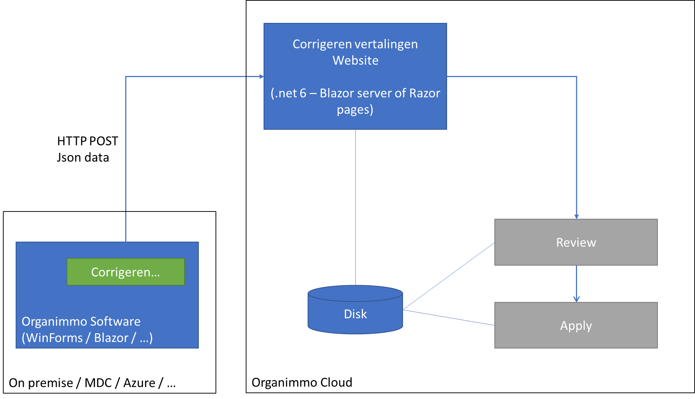

# VGT2 case

## Probleem

De software van Organimmo is beschikbaar in het Nederlands en binnenkort ook in het Frans en het Engels. Echter specifieke bewoording in deze talen niet standaard gekend. De vertalingen beschikbaar via diverse kanalen zoals Google Translate / Deeple / ... zijn niet accuraat. Ook een vertaalslag voorzien via een vertaalbureau is niet evident (kennis van beheer van eigendom, de kost van vertaling, cyclus van aanlevering bij nieuwe modules en integratie platformen).

Daarom is het idee om gebruik te maken van de Organimmo community, en via onze eindgebruikers van de software de nodige vertalingen, aanpassingen en juiste bewoordingen in het Frans en Engels te laten voorzien en/of te verbeteren.

## Uitdaging high level

De boodschappen, kolomtitels, velden, ... die in de programma’s Organimmo syndic, Organimmo rentmeester, Organimmo 
vakantieverhuur ter beschikking zijn, zullen in een JSON / XML file te beschikking gesteld worden. Dit kan bvb na het klikken op een knop "Correcties vertaling voorstellen" op een bepaald formulier.

Deze data wordt dan beschikbaar gesteld in een nieuw te ontwikkelen web-pagina met daarop de originele tekst en de huidige  vertaling die door de eindgebruiker kan aangepast worden.

Een koppeling met Google Translate om vertalingen voor te stellen voor ontbrekende vertalingen is nice to have.

Na het bewaren worden de aanpassingen bewaard ter review van Organimmo, en kunnen de aanpassingen (al dan niet 
automatisch) opgenomen worden in de huidige software. 

## Technische beschrijving

### Flow:

Schema:

* Voorstel is om gebruik te maken van Post-Redirect-Get:
https://en.wikipedia.org/wiki/Post/Redirect/Get
* Genereren Json data en HTTP POST gebeurt door de bestaande software  
`POST https://translate.organimmo.com/ProposeCorrection`  
out of scope voor dit project (dient te gebeuren door Organimmo)
* Na ontvangen van de POST wordt de Json data door jullie bewaard (`<GUID>.json` als plain text op de server), en gebeurt een redirect (`303 See other`) met 
deze `<GUID>` als query parameter, bvb:  
`GET https://translate.organimmo.com/ProposeCorrection?id=<GUID>`
* Deze pagina dient voor dit project ontwikkeled te worden.
* Alle nodig data komt uit de Json file.  Bij de documentatie vind je 2x dezelfde voorbeeldfile, één maal de originele file, en één maal geannoteerd met commentaar.

### Technologische constraints

* Site in .net Core Blazor (server-side) of Razor
* File op server in Json of Xml (lichte voorkeur voor Json).  Indien Xml, graag dezelfde structuur als de voorbeeldfile.
* Graag code/commentaar/... in Engels, UI in Nederlands.

### Voorstel van pagina

(overgenomen van een gelijkaardige functionaliteit bij de DevExpress component library)

Bij het bewaren kan hetzelfde Json file gebruikt worden, uitgebreid met de nieuwe vertaling, cfr. de geannoteerde voorbeeldfile.

## Nice to haves, follow-ups

* Pagination
* Zoeken
* Filtering (enkel ontbrekende vertalingen tonen, …)
* Koppeling met Google Translate voor ontbrekende
* Multi-taal ondersteuning (kolom headers, "Bewaren", ... op jullie site)
* Gebruik van jullie eigen site om vertaalfouten op jullie eigen site te rapporteren (zo heb je meteen een praktische use-case)
* Authentication (gebruiker heeft een access token in de software, dus een access token kan meegegeven worden, zonder nieuwe sign-in).
* Review door een *Product Owner* van Organimmo, die gebruik kan maken van dezelfde pagina

